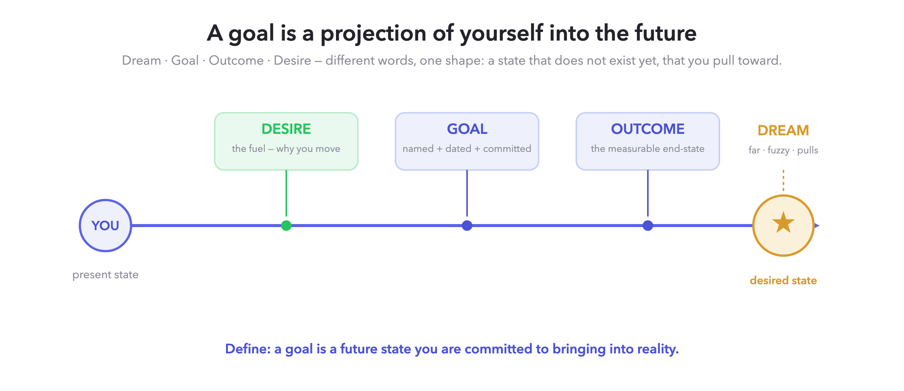
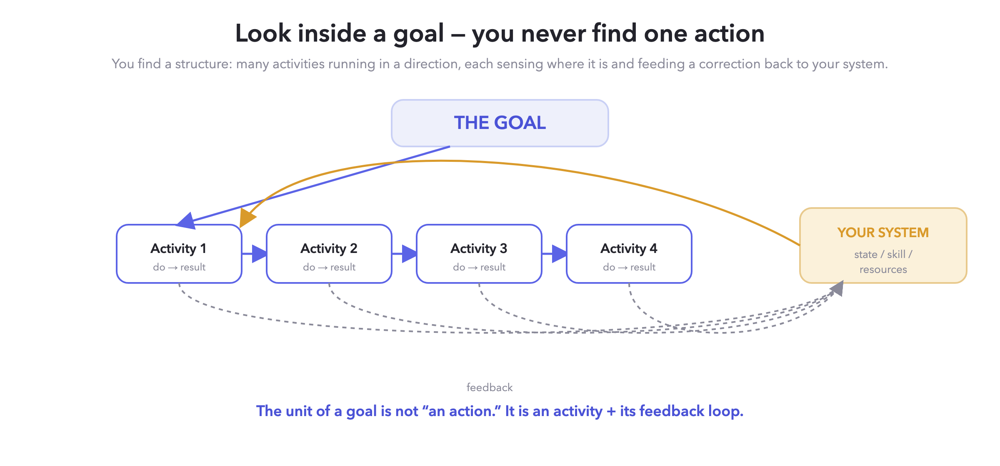
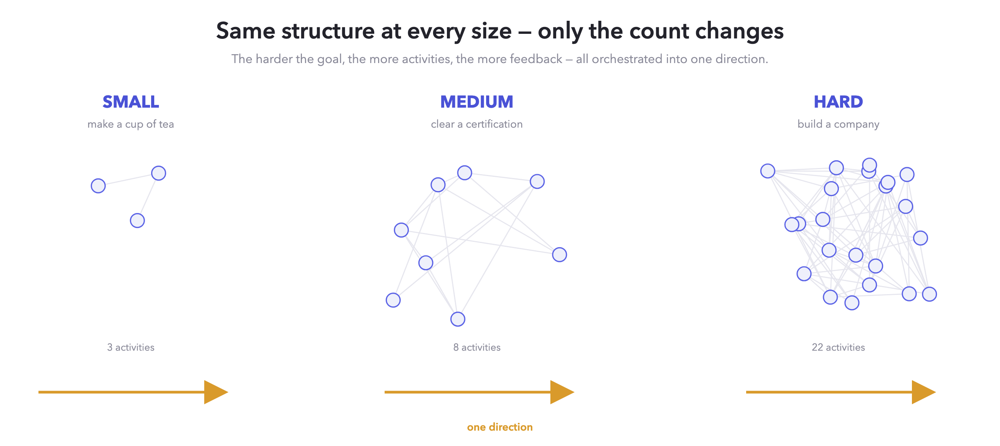
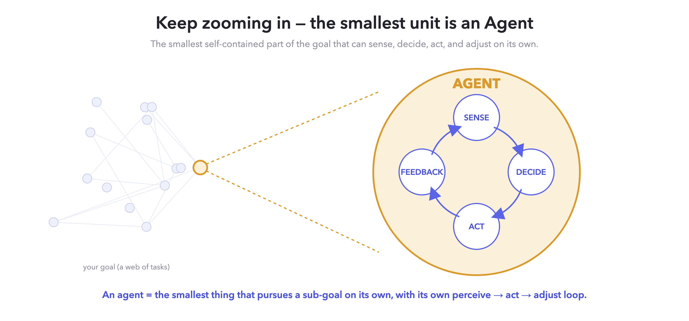
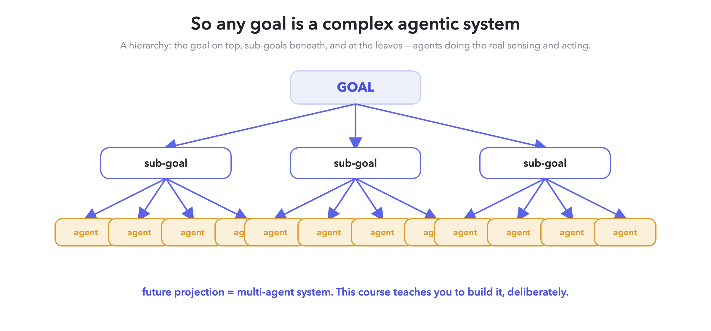
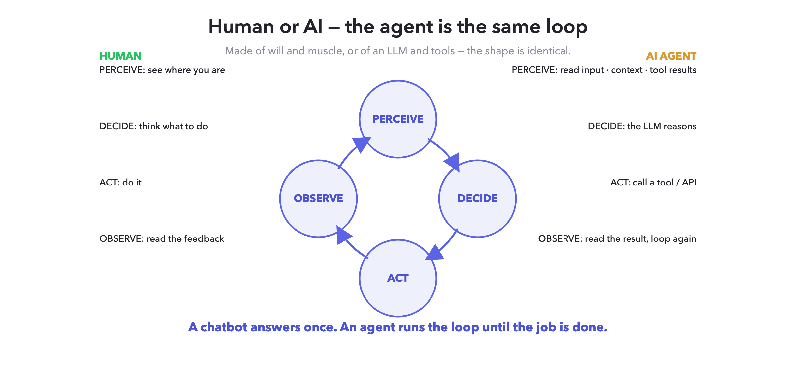

# What is an Agent?
### Module 2 · Foundations — *Build Agentic AI Systems* (TrigunAI)

> **How to use this doc:** This is the reference for the recorded video + the student's read-along
> in the LMS. Each section has the **idea**, the **diagram**, and a 🎥 **On-camera** line (what to
> say / show while recording). Tests live in the LMS — this doc is for *understanding*, not grading.

---

## The big idea (say this first)

> **We will not start with code, or with AI. We will start with something you already know better
> than any engineer: wanting something.** Once you see the shape of a *goal*, you will see that an
> agent was hiding inside it the whole time.

---

## 1. Everything starts with a wanting

Goal. Desire. Outcome. Dream. A long-term projection. A wanting.

Different words — but look closely and they are **one shape**: a state that does **not exist yet**,
that you are pulling yourself toward. You are *here*; the wanting is *there*; and something in you
leans across the gap.

- **Dream** — far, fuzzy, it *pulls* you but isn't dated.
- **Desire** — the *fuel*. The why. The reason you move at all.
- **Goal** — a dream that got *named, dated, and committed to*.
- **Outcome** — the *measurable end-state* you'll point at and say "done."

> **Definition.** A **goal** is a future state you are committed to bringing into reality.

🎥 *On-camera:* point at yourself ("you, now") and point away ("the thing you want") — "every goal
is just this: a line from here to there." Keep it human. No tech yet.

---

## 2. Look inside a goal — you never find *one* action

Here's the move most people miss. Take any goal and **zoom in**. You will never find a single,
clean action sitting there. You find a **structure**: many *activities*, running together in a
direction — and each activity is quietly **sensing where it is and feeding a correction back** into
your system (your skill, your state, your resources).

You try → you get a result → that result changes you → your next try is different.

> **The unit of a goal is not "an action." It is an activity *plus* its feedback loop.**

That feedback is the whole secret. A thermostat isn't smart because it heats — it's smart because
it *reads the room and adjusts*. Same with you chasing a goal. Same, as we'll see, with an agent.

🎥 *On-camera:* use a tiny example live — "I'm learning to cook. I salt the dish (activity), I taste
it (feedback), the next pinch is smaller. The *loop* is the intelligence, not the salting."

---

## 3. The same structure at every size — small, medium, hard

This structure doesn't change when the goal gets bigger. **Only the count changes.**

- **Small goal** — *make a cup of tea.* A handful of activities, seconds of feedback.
- **Medium goal** — *clear a certification.* Dozens of activities, weeks of feedback loops.
- **Hard goal** — *build a company.* Thousands of interconnected activities, many sub-directions,
  all forced to converge into **one direction**.

> The harder the goal, the more activities, the more feedback — and the more they must be
> **orchestrated** so all that motion points one way.

🎥 *On-camera:* "A hard goal isn't a different *kind* of thing. It's the same tea-loop — just
thousands of them, wired together, all aimed in one direction."

---

## 4. Keep zooming in — the smallest part is an **Agent**

Now take the goal's web of activities and keep breaking it down. Smaller. Smaller. Until you reach
a unit you **can't usefully split any further** — one self-contained piece of work that, on its own:

1. **senses** its little slice of the world,
2. **decides** what to do about it,
3. **acts**, and
4. **reads the feedback** and adjusts.

**That smallest, self-running unit is an agent.**

> **Definition.** An **agent** is the smallest unit that can pursue a sub-goal *on its own*, with
> its own **sense → decide → act → feedback** loop.

🎥 *On-camera:* this is the punchline of the module — slow down. "The agent was never an exotic new
thing. It's just the smallest piece of *going after a goal* that can run itself."

---

## 5. So any goal is a **complex agentic system**

Put the two truths together:

- the **smallest unit** of a goal is an agent, and
- a **goal** is many such units, interconnected, aimed in one direction.

Therefore **any goal — any future projection — is a complex agentic system.** A hierarchy: the goal
on top, sub-goals beneath it, and at the leaves, the agents doing the real sensing and acting.

> **Future projection = multi-agent system.** Teams, bodies, ecosystems, companies — they're all
> already built this way. This course just teaches you to build one **deliberately, in software.**

🎥 *On-camera:* "You've been running multi-agent systems your whole life — you just called them
'plans.' We're going to make them out of code."

---

## 6. Now bring in AI — same loop, different material

Everything above is true of humans, teams, and nature. An **AI agent is the exact same shape**, only
the material is software:

| The loop | A human doing it | An **AI agent** doing it |
|---|---|---|
| **Perceive** | see where you are | read the input · context · tool results |
| **Decide** | think what to do | the **LLM reasons** |
| **Act** | do it | **call a tool / API** |
| **Observe** | read the feedback | read the result — then loop again |

> **This is the line that separates a chatbot from an agent:**
> **A chatbot answers once. An agent runs the loop until the job is done.**

A chatbot is *perceive → decide → reply → stop.* An agent closes the loop — it observes what
happened and goes around again, tool after tool, until the sub-goal is actually met. That repetition,
driven by feedback, is the whole game.

🎥 *On-camera:* show two terminals side by side if you can — one that answers once, one that loops a
tool 3–4 times to finish a task. The *looping* is the "aha."

---

## 7. Why this is the foundation of the whole course

This isn't philosophy for its own sake — it's the blueprint for everything you'll build:

- **Your BYOA** ("Build Your Own Agent") starts as a **goal** — a real, repetitive job you want done.
- We'll **decompose** that goal into sub-goals (Module 5: planning).
- We'll build the **smallest agents** that sense and act — giving them **tools** (Module 3) and
  **memory** (Module 4).
- We'll **interconnect** them into one direction (Module 7: orchestration / multi-agent).
- And we'll make the loop **reliable** enough to trust (Module 8).

You are learning to take a future projection and **engineer it into a working agentic system.**

> **Closing line (use it to end the video):**
> *"An agent is a fragment of will, given the means to sense and act. Build enough of them, pointed
> in one direction, and you have built a mind that pursues a goal."*

---

### One-sentence recap (put on the last slide)
> A **goal** is a future state you're pulling toward; break it down far enough and the smallest
> self-running piece is an **agent** — *perceive → decide → act → observe, looping until done* — so
> every goal is really a **multi-agent system**, and this course teaches you to build one in code.

---
*TrigunAI · Build Agentic AI Systems · Module 2 — What an Agent Actually Is.*
*Diagrams: `images/d1…d6`. Rebuild with `build_diagrams.py`.*
